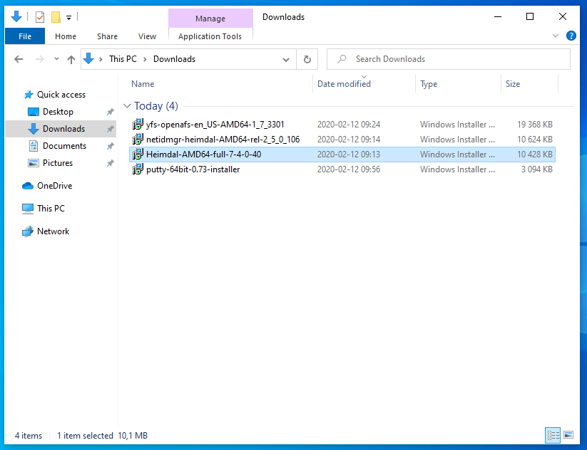
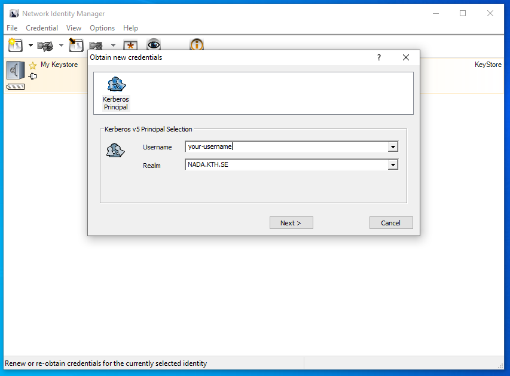
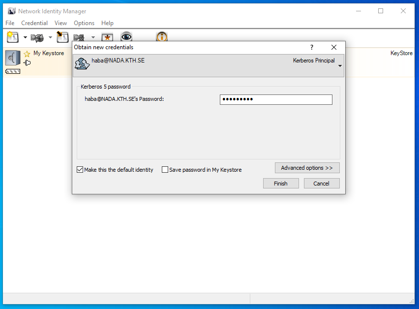
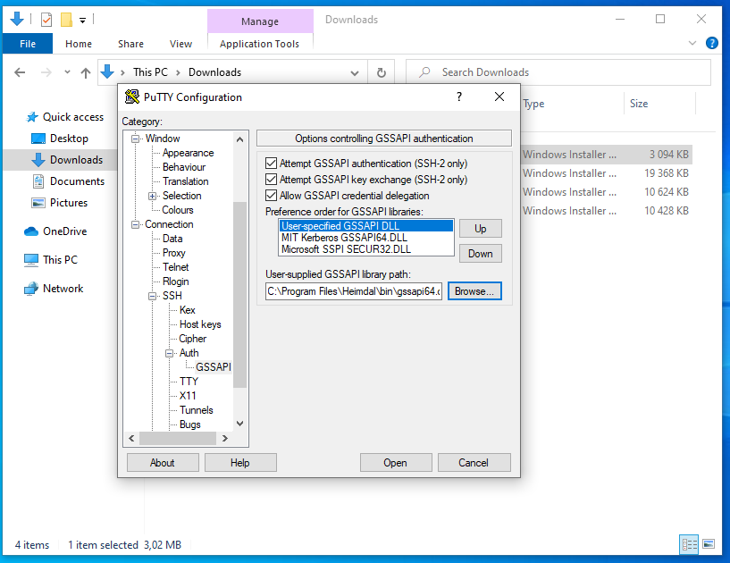
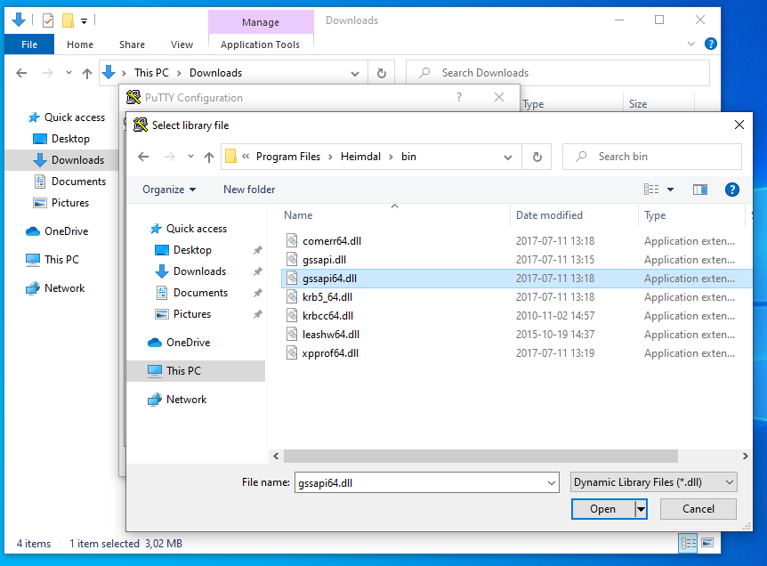
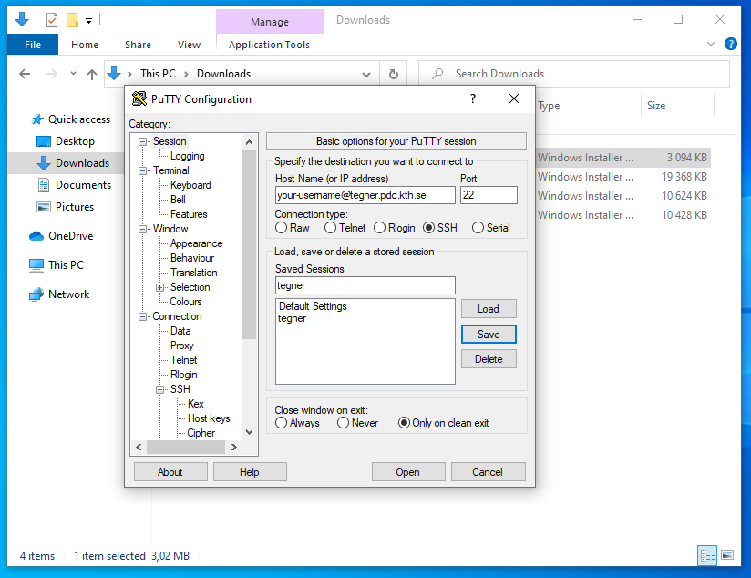

# How to login from Windows

## Kerberos based authentication

This section describes how to acquire kerberos tickets in Windows and log in to PDC. For information on how to login from Windows using SSH key based authentication, please refer to [this page](./ssh_login.md#windows)

There are two essentially different ways to log in from Windows:

1. [Install and configure Kerberos and ssh for Windows](#install-and-configure-kerberos-and-ssh-for-windows) (using Network Identity Manager and PuTTY)
1. [Install and configure Windows Subsystem for Linux (WSL)](#install-and-configure-windows-subsystem-for-linux-wsl) (this requires Windows 10 or higher)

Note that if you have a KTH-Windows machine, the necessary software has
to be installed by KTH IT department.
For help with this, please contact [it-support@kth.se](mailto:it-support@kth.se).


### Install and configure Kerberos and ssh for Windows

Here are the installers that you need:

> 

Links to installation packages:

1. **Heimdal Kerberos**: Download the newest Heimdal Kerberos for Windows
   (32-bit or 64-bit depending on your computer’s architecture).
   The latest version can be found at [https://www.secure-endpoints.com/heimdal/](https://www.secure-endpoints.com/heimdal/).
   Run the downloaded installer, and choose to install a complete installation of Heimdal.

   In case the download link is temporarily down, you can obtain the installer
   [from this link](https://pdc-web.eecs.kth.se/files/software/installers/Heimdal-AMD64-full-7-4-0-40.msi).
   If you want to confirm the integrity of the installer, you can compute
   the MD5SUM checksum (e.g., according to
   [these instructions](https://www.lifewire.com/validate-md5-checksum-file-4037391)).
   The MD5SUM checksum of the 64-bit installer version 7.4 is:
   ```default
   $ md5sum Heimdal-AMD64-full-7-4-0-40.msi
     282817ef0e1a07f0763def9713bdf995  Heimdal-AMD64-full-7-4-0-40.msi
   ```
1. **Network Identity Manager (NIM)**: Download the newest installer from
   [https://www.secure-endpoints.com/netidmgr/v2/#download](https://www.secure-endpoints.com/netidmgr/v2/#download) (choose the
   version that matches your operating system). Installation
   of NIM is usually straightforward.

   In case the download link is temporarily down, you can obtain the installer
   [from this link](https://pdc-web.eecs.kth.se/files/software/installers/netidmgr-heimdal-AMD64-rel-2_5_0_106.msi).
   The MD5SUM checksum of the 64-bit installer version 2.5 is:
   ```default
   $ md5sum netidmgr-heimdal-AMD64-rel-2_5_0_106.msi
     5c4945e9cc36a3b67982911b95554f5d  netidmgr-heimdal-AMD64-rel-2_5_0_106.msi
   ```
1. **PuTTY**: A version of PuTTY which supports GSSAPI and Heimdal Kerberos.
   is needed, i.e. version 0.72 and later.
   Installers can be downloaded
   [from this page](https://www.chiark.greenend.org.uk/~sgtatham/putty/).

   In case the download link is temporarily down, you can obtain the installer
   [from this link](https://pdc-web.eecs.kth.se/files/software/installers/putty-64bit-0.74-installer.msi).
   The MD5SUM checksum of the 64-bit installer for version 0.74 is:
   ```default
   $ md5sum putty-64bit-0.74-installer.msi
     a76dd5040fb8bd78a4a5acbf445741a2  putty-64bit-0.74-installer.msi
   ```
1. **(Optional) AFS client**: Download the newest OpenAFS client for Windows from
   [https://www.auristor.com/openafs/client-installer/](https://www.auristor.com/openafs/client-installer/) (32-bit or 64-bit
   depending on your computer’s architecture). The client allows you to access
   your PDC home directory from your local computer’s file browser.

   In case the download link is temporarily down, you can obtain the installer
   [from this link](https://pdc-web.eecs.kth.se/files/software/installers/yfs-openafs-en_US-AMD64-1_7_3301.msi).
   The MD5SUM checksum of the 64-bit installer for version 1.7 is:
   ```default
   $ md5sum yfs-openafs-en_US-AMD64-1_7_3301.msi
     7ea76eb80c8285f55c51550d593a271c  yfs-openafs-en_US-AMD64-1_7_3301.msi
   ```

After downloading these installers, follow the instructions below
to configure your login.

### Setting up Network Identity Manager

The easiest option to create and manage Kerberos tickets is the
Network Identity Manager (NIM). NIM can also manage multiple tickets
from different realms.

After opening NIM, choose the advanced NIM view:

> 

Obtain new credentials dialog:

> 

Choose the following options. You may need longer ticket lifetimes if
you have long running batch jobs:

> 

Put in password and check the [x] make default box:

> 

This is how NIM looks with kerberos tickets and AFS tokens:

> 

For further information on managing Kerberos tickets via NIM, please
visit [https://www.secure-endpoints.com/netidmgr/v2/docs/](https://www.secure-endpoints.com/netidmgr/v2/docs/).

#### Alternative to NIM Kerberos config file

Follow instructions at [How to configure kerberos and SSH with kerberos](configuration.md) and how to acquire
Kerberos tickets. You may need administrator privileges to be able to
edit Kerberos configuration file under Windows.


### Setting up PuTTY

PuTTY is a convenient method of connecting to PDC clusters from
Windows. PuTTY is an SSH and telnet client, developed originally by
Simon Tatham for the Windows platform.  PuTTY is open source software
that is available with source code and is developed and supported by a
group of volunteers.

The first step is to create what is called a Session in PuTTY.  A
session is basically a collection of settings for a connection to a
machine.

In the field Host Name at the top, enter `your-username@cluster.pdc.kth.se`
(substituting `your-username` and `cluster` as needed). Make sure the port
is 22 and that SSH is selected underneath.

Now configure GSSAPI settings by selecting Connection > SSH > Auth >
GSSAPI and specify GSSAPI DLL:

> 

The GSSAPI library is normally installed here.
The User-Specified GSSAPI DLL must be on top of the list (press [Up] if neccessary:

> 

Now go to Connection > SSH > KEX. In the Algorithm selection policy mark the line

```default
"--warn below here--"
```

and press “Down” until it’s below the warning:

```default
Diffie-Hellman group 14
```

As seen in the image below:

> 

Before logging in, save your PuTTY config as a profile named _dardel_:

<!--- 
> 
--->


Now, click Open. If you have valid Kerberos tickets as explained above you will now log in to the cluster. Please note that selecting a saved profile and changing some settings wouldn't implement these changes to the existing/selected profile. 

<!--- A Dardel login looks like this:

>  --->

<!--The path to your PDC home directory from Windows is
`\\afs\pdc.kth.se\home\u\username` with `u` as the first letter in your username. -->

When you login to Dardel, you would reach your home directory on the LUSTRE file system :
`cfs/klemming/home/u/username` with `u` as the first letter in your username.

While PuTTY is our recommended SSH client for Windows, it should be possible
also to use Cygwin. For instructions on using Cygwin, see the section
[Alternative to PuTTY under Windows: Cygwin](#alternative-to-putty-under-windows-cygwin) below.

### Install an X server optional 

If you would like to run graphical programs, you need to additionally
install an X server. There are several X servers that run on Windows,
including:

- [Xming](https://sourceforge.net/projects/xming/)
- [Cygwin X](http://x.cygwin.com/)
- [vcXsrv](https://sourceforge.net/projects/vcxsrv/)

We recommend *Xming*, and the process to set it up is as follows:

1. Install [Xming](https://sourceforge.net/projects/xming/)
1. Start Xlaunch on Windows.
1. In PuTTY, load a connection to dardel.
1. In Connection > SSH > X11, check the box “Enable X11 forwarding”.
1. Open the connection to dardel.
1. You should now be able to use software with graphical windows locally
   (test that first) and remotely through X11-forwarding. On the remote
   (PDC) side the DISPLAY will be setup automatically. Before starting
   advanced remote visualization tools we recommend to start xterm to
   check the connection.


## Install and configure Windows Subsystem for Linux WSL 

The WSL lets users run a GNU/Linux environment,
including most command-line tools, utilities, and applications,
directly on Windows. WSL requires Windows 10 or newer.
See the [offical documentation](https://docs.microsoft.com/en-us/windows/wsl/about) for further information.

A step-by-step installation process is as follows:

1. Enable Windows Subsystem Linux according to first section at: [https://docs.microsoft.com/en-us/windows/wsl/install-win10](https://docs.microsoft.com/en-us/windows/wsl/install-win10)
1. Download a Linux distro, e.g. Ubuntu, from Microsoft Store.
1. Install it.
1. Choose a username for this distribution. It does not need to be the same as your Windows user.
1. Choose a password for this user (NB: this is not for your Windows user)
1. Update the packages by typing: sudo apt update
1. Upgrade packages: sudo apt upgrade
1. Follow login instructions for [How to login from Ubuntu/Debian](linux_login.md#how-to-login-from-ubuntu-debian) (or a corresponding
   page for another Linux distribution that you have chosen)

The Windows file system is mounted under `/mnt/c/`. In other words, you
can copy files between from your regular Windows file system by:

```default
$ cp /mnt/c/<path-relative-to-C> <Linux-file-system-path>/
```

and vice versa.

If you would like to run graphical programs on WSL, you need to additionally
install an X server. There are several X servers that run on Windows,
including:

- [Xming](https://sourceforge.net/projects/xming/)
- [Cygwin X](http://x.cygwin.com/)
- [vcXsrv](https://sourceforge.net/projects/vcxsrv/)

We recommend *Xming*, and the process to set it up for use within WSL is as follows:

1. Install [Xming](https://sourceforge.net/projects/xming/)
1. Start Xlaunch on Windows.
1. In the Ubuntu terminal, type `export DISPLAY=localhost:0`. If you put this command in the file `.bashrc` in your home directory, it will be automatically set next time you start.
1. You should now be able to use software with graphical windows locally
   (test that first) and remotely through X11-forwarding. Use the -Y
   option of ssh for that. On the remote (PDC) side the DISPLAY
   will be setup automatically. Before starting advanced remote
   visualization tools we recommend to start xterm to check the
   connection.


### Alternative to PuTTY under Windows Cygwin

#### WARNING
These instructions are written for older versions on Cygwin. Unfortunately they do not work on current versions.

Cygwin can be used instead of PuTTY under Windows.
The Cygwin environment gives you a lot of commands in your Windows
environment that normally are available only under Unix/Linux.  Among
these commands are bash, grep and less.  Cygwin is needed because it
contains the libraries (i.e. DLL-files) and utility programs that
Heimdal will use. After the installation you will be able to use
Kerberos enabled login methods to connect to PDC.

**Installation**

1. If you already have an old Cygwin or Cygwin based installation on your system you have to do some manual steps as
   described on [http://www.cygwin.com/](http://www.cygwin.com/) before upgrading to Cygwin 2.9.0
1. As most computers nowadays are 64-bit, we only suppory 64-bit Cygwin.
   There is currently no version available for 32-bit Cygwin any more.
   The pdclogin-0.8 package has been tested on 64-bit-Win8.
1. To install Cygwin with X11 please follow the instructions
   described in [http://x.cygwin.com/docs/ug/setup.html](http://x.cygwin.com/docs/ug/setup.html).
   Especially note that during step 15 of the install you want to make sure that you select the packages:
   * xorg-server
   * Xinit
   * X-start-menu-icons (if available)
   * xterm
   * wget
   * crypt
   * libssp
   * libopenssl098 (or greater)
1. Start the Cygwin X11 server (Programs->Cygwin-X->XWinServer) and an xterm (Programs->Cygwin-X->xterm).
   The XWin server is controlled (for example ended) by right-click on the small X icon in your taskbar.
1. Windows will ask you now if you want to open the firewall for XWin.
   **Answer “Keep Blocking” as we do not want anyone to connect to your XWin from the Internet.**
1. Download the pdclogin-0.8 package from the cygwin xterm
   ```default
   wget https://pkgserver.pdc.kth.se/pub/heimdal/binaries/amd64-pc-cygwin/pdclogin-0.8-amd64.tar.gz
   ```
1. Check the checksum of the downloaded file
   ```default
   sha1sum pdclogin-0.8-amd64.tar.gz
   e17a8f79663dff2bcd4901251206ad1bffe81c2f  pdclogin-0.8-amd64.tar.gz
   ```
1. Extract and then open the downloaded file
   ```default
   tar xzvf pdclogin-0.8-amd64.tar.gz
   ```

   This will generate a directory named pdclogin-0.8-amd64.
1. Read the README file in the above mentioned directory (any additional information specific to the version will be there)

**Using Cygwin**

1. Start Cygwin if necessary (as during Install above)
1. Use the kinit and ssh commands directly or use the pdclogin script to login at PDC
   ```default
   ./pdclogin -Y <USERNAME>@<CLUSTER>.pdc.kth.se
   ```

   USERNAME should be replaced by your PDC user name.
   Similarily, CLUSTER should be replaced by the PDC computer which you want to reach.
   pdclogin is located in ~/pdclogin-0.8.
   pdclogin takes any SSH command line options (like -Y).
1. If you get an error message containing unable to find realm of host then you
   have not followed the README mentioned during the Install.
1. In order to transfer files you use the pdccopy script included in the pdclogin-0.8 folder. For instance
   ```default
   ./pdccopy ./README <USERNAME>@<CLUSTER>.pdc.kth.se :~/Private/
   ```

   would transfer the file README in your local cygwin directory ~/pdclogin-0.8 to the
   folder Private in your home directory at PDC.
